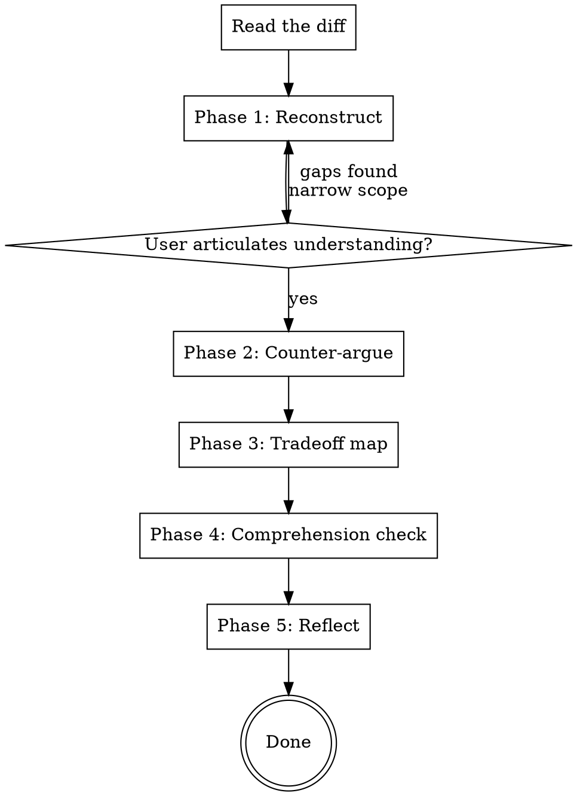

# Calibrate

Post-implementation thinking review. Not a code review — a check on whether you understood what shipped.

**Core idea:** Code ships whether you understood it or not. This skill measures which side of the line you're on. Based on Addy Osmani's cognitive surrender vs. cognitive offloading distinction.

## When to Use

- After `/dev` or `/next` completes a feature
- Before `/commit` on substantial changes
- When you feel "it works but I'm not sure why"
- When a lot of agent-generated code landed without much back-and-forth

## Process

## Phase 1: Reconstruct

Read the diff on the current branch (vs main). Then ask the user to explain, in their own words:

1. **What does this change do and why?**
2. **What are the 2-3 most significant design decisions in this implementation?**

Do NOT show the diff or provide hints. The point is to see what the user can reconstruct from memory. If they struggle, that's valuable signal — not failure. Help them narrow scope and try again on a smaller piece.

Ask these as a single prompt. Wait for the user's response before proceeding.

## Phase 2: Counter-argue

Based on the diff, generate 2-3 pointed counter-arguments against the implementation choices. These should be genuine alternatives, not strawmen:

- "You chose X. When would Y have been the better call?"
- "This creates coupling between A and B. What happens when B changes?"
- "What's the failure mode here under [specific edge condition]?"

Present them and let the user respond. The goal is to break borrowed confidence — if the user can defend the choices with their own reasoning, they own the decision. If they can't, the decision was inherited.

## Phase 3: Tradeoff Map

For the 2-3 most consequential decisions in the diff, present a tradeoff table:

| Decision | Chose | Alternative | Tradeoff |
|----------|-------|-------------|----------|
| ... | ... | ... | ... |

Ask the user: "Anything here you hadn't considered? Anything you'd revise?"

## Phase 4: Comprehension Check

Ask 2-3 targeted questions that test understanding of *why* the code works, not *that* it works. Examples:

- "Without looking: what happens if the API returns a 409 here?"
- "Which component re-renders when this state changes?"
- "What's the query that runs when this mutation fires?"

The user answers, then you show the actual answer from the code. No judgment — just calibration.

## Phase 5: Reflect

Ask one question:

> "On a scale of directed-to-accepted: how much of this did you *direct* vs. *accept*?"

No scoring. No tracking. Just a moment of honest self-assessment. Then summarize what the session surfaced — any blind spots, any decisions worth revisiting, any areas where understanding was stronger than expected.

## Principles

- **5 minutes, not 25** — this is a sharpening tool, not a second review
- **Non-blocking** — never prevents commits or shipping
- **Thinking review, not code review** — code-reviewer handles quality, this checks comprehension
- **Scale to diff size** — small diffs get phases 1-2 only, large features get the full flow
- **No gamification** — the moment it becomes a score to optimize, it becomes performative
- **Honesty over comfort** — struggling to reconstruct is the valuable signal, not the failure case
